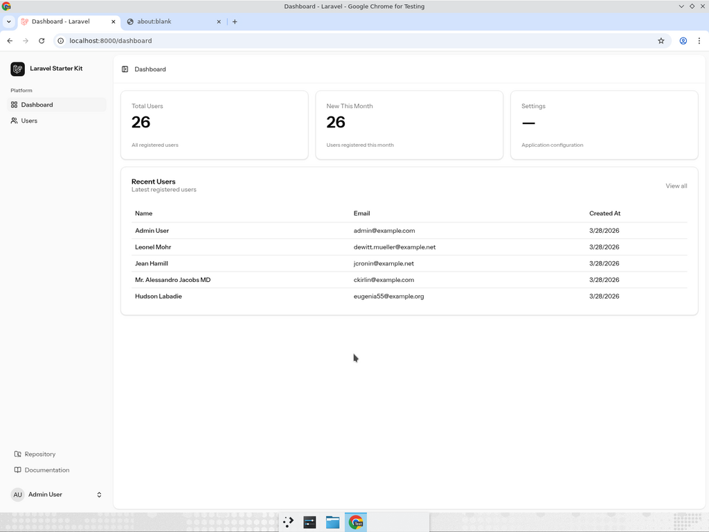
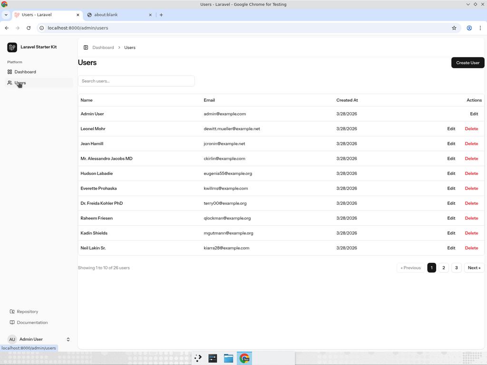
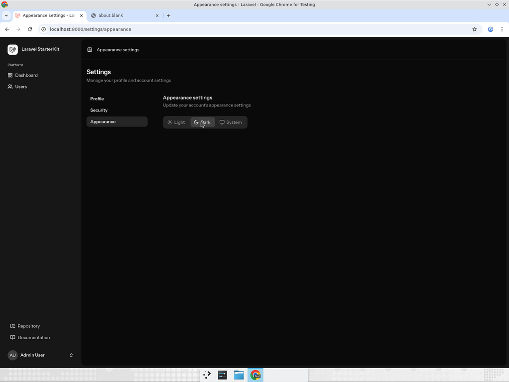

<p align="center">
  
</p>

<h1 align="center">Admin Boilerplate</h1>

<p align="center">
  <strong>A production-ready admin panel built with the modern Laravel stack.</strong><br />
  Stop building the same dashboard from scratch — start here and focus on what makes your app unique.
</p>

<p align="center">
  <a href="https://github.com/fifijo/interiajs-admin/actions"></a>
  <a href="https://github.com/fifijo/interiajs-admin/actions"></a>
  
  
  
  
  
  
  
  
  
</p>

<br />

<p align="center">
  <picture>
    <source media="(prefers-color-scheme: dark)" srcset="docs/screenshots/dashboard-dark.png" />
    
  </picture>
</p>

---

## Why This Boilerplate?

Most Laravel admin panels make you choose between **modern frontend tooling** and **rapid backend development**. This boilerplate gives you both — a fully typed React frontend with Inertia v3's seamless SPA experience, backed by Laravel 13's elegant backend.

**What you get out of the box:**

- **User management** — Full CRUD with search, pagination, and self-deletion guard
- **Dashboard** — Live stats, recent activity table, and card-based layout
- **Flash toasts** — Themed Sonner notifications that respect dark mode
- **Type-safe routing** — Wayfinder-generated route helpers with full TypeScript support
- **AI-powered development** — Laravel Boost MCP servers for your AI editor
- **Three testing layers** — Pest + Vitest + Playwright covering backend, components, and E2E

---

## Tech Stack

<table>
  <tr>
    <td align="center" width="96"><br /><b>Laravel 13</b></td>
    <td align="center" width="96"><br /><b>React 19</b></td>
    <td align="center" width="96"><br /><b>TypeScript</b></td>
    <td align="center" width="96"><br /><b>Tailwind 4</b></td>
    <td align="center" width="96"><br /><b>shadcn/ui</b></td>
  </tr>
  <tr>
    <td align="center" width="96"><br /><b>Biome</b></td>
    <td align="center" width="96"><br /><b>Pest</b></td>
    <td align="center" width="96"><br /><b>Vitest</b></td>
    <td align="center" width="96"><br /><b>Playwright</b></td>
    <td align="center" width="96"><br /><b>SQLite</b></td>
  </tr>
</table>

| Layer | Technologies |
|-------|-------------|
| **Backend** | Laravel 13 · PHP 8.3+ · Fortify · Wayfinder |
| **Frontend** | React 19 · TypeScript 5.7 · Tailwind CSS 4 · shadcn/ui |
| **Bridge** | Inertia.js v3 (SPA without the SPA complexity) |
| **Quality** | Biome 2.4 (format + lint + imports) |
| **Testing** | Pest (feature) · Vitest (component) · Playwright (E2E) |
| **AI Tooling** | Laravel Boost (MCP servers · skills · guidelines) |
| **Database** | SQLite (default) · MySQL · PostgreSQL |

---

## Screenshots

| Dashboard (Light) | Users Management | Dark Mode |
|:---:|:---:|:---:|
|  |  |  |
| Stats cards · Recent users table | Paginated table · Search · CRUD | Full dark mode support |

---

## Quick Start

> **Prerequisites:** PHP 8.3+ · Composer · Node.js 18+ · npm

```bash
# 1. Clone
git clone https://github.com/fifijo/interiajs-admin.git
cd interiajs-admin

# 2. Install dependencies
composer install
npm install

# 3. Environment setup
cp .env.example .env
php artisan key:generate

# 4. Database
php artisan migrate
php artisan db:seed          # 1 admin + 25 test users

# 5. Generate type-safe routes
php artisan wayfinder:generate

# 6. Launch
composer run dev             # Starts everything: server + vite + queue + logs
```

Open **http://localhost:8000** and log in:

| | |
|---|---|
| **Email** | `admin@example.com` |
| **Password** | `password` |

---

## Development

### Commands

```bash
# Code quality
npm run check               # Biome: format + lint + organize imports
npm run format              # Biome: format only
npm run lint                # Biome: lint only
npm run types:check         # TypeScript type checking

# Testing
php artisan test            # 11 Pest feature tests
npm run test                # 12 Vitest component tests
npm run test:e2e            # Playwright E2E tests

# Build
npm run build               # Production build
npm run build:ssr           # SSR production build
```

### Testing Pyramid

```
         /  E2E  \           Playwright     ~7 tests    ~2-5s each
        / Component \        Vitest         ~12 tests   ~20ms each
       /   Feature   \       Pest           ~11 tests   ~200ms each
      ‾‾‾‾‾‾‾‾‾‾‾‾‾‾‾‾
```

### AI Agent Setup

This project ships with [Laravel Boost](https://github.com/laravel/boost) for AI-assisted development:

```bash
php artisan boost:install        # Select your AI agent (Cursor, Windsurf, etc.)
```

This generates `.mcp.json` with MCP tools for:
- **Database queries & schema** — inspect your DB without leaving the editor
- **Laravel docs search** — 17,000+ pages of ecosystem documentation
- **Error & browser logs** — debug faster with AI context

---

## Project Structure

```
.
├── app/
│   ├── Http/
│   │   ├── Controllers/
│   │   │   ├── Admin/
│   │   │   │   └── UserController.php      # User CRUD with search & pagination
│   │   │   └── DashboardController.php     # Stats & recent users
│   │   ├── Middleware/
│   │   │   └── HandleInertiaRequests.php   # Shared data: auth, flash, sidebar
│   │   └── Requests/Admin/
│   │       ├── StoreUserRequest.php        # Create validation
│   │       └── UpdateUserRequest.php       # Update validation
│   └── Policies/
│       └── UserPolicy.php                  # Authorization stub
├── database/
│   └── seeders/
│       └── UserSeeder.php                  # Admin + 25 factory users
├── resources/js/
│   ├── components/
│   │   ├── ui/                             # 25+ shadcn/ui components
│   │   └── app-sidebar.tsx                 # Navigation sidebar
│   ├── layouts/
│   │   └── app-layout.tsx                  # Main layout + flash toasts
│   ├── pages/
│   │   ├── admin/users/
│   │   │   ├── index.tsx                   # Paginated user table
│   │   │   ├── create.tsx                  # Create user form
│   │   │   └── edit.tsx                    # Edit user form
│   │   ├── dashboard.tsx                   # Stats cards + recent users
│   │   ├── auth/                           # Login, register, 2FA, etc.
│   │   └── settings/                       # Profile, appearance, security
│   └── tests/                              # Vitest component tests
├── tests/
│   ├── Feature/Admin/                      # Pest feature tests
│   └── e2e/                                # Playwright E2E tests
├── biome.json                              # Biome config (replaces ESLint/Prettier)
└── vite.config.ts                          # Vite + Inertia + Tailwind + Wayfinder
```

---

## Extending the Boilerplate

### Adding a New Admin Page

```bash
# 1. Create the controller
php artisan make:controller Admin/ProductController --resource

# 2. Add the route (routes/web.php)
Route::resource('products', Admin\ProductController::class)->except(['show']);

# 3. Regenerate type-safe route helpers
php artisan wayfinder:generate

# 4. Create the page component
# resources/js/pages/admin/products/index.tsx

# 5. Add to sidebar (resources/js/components/app-sidebar.tsx)
```

### Adding shadcn/ui Components

```bash
npx shadcn@latest add <component-name>
# Components install to resources/js/components/ui/
```

Browse the full library at [ui.shadcn.com](https://ui.shadcn.com/docs/components).

---

## Layout Variants

The starter kit includes multiple layout configurations:

| Type | Options |
|------|---------|
| **Sidebar** | `inset` (default) · `floating` · `default` |
| **Auth** | `simple` · `card` · `split` |

---

## Contributing

1. Fork the repository
2. Create your feature branch (`git checkout -b feature/amazing-feature`)
3. Run quality checks (`npm run check && php artisan test`)
4. Commit your changes
5. Push and open a Pull Request

---

## License

This project is open-sourced software licensed under the [MIT license](LICENSE).

---

<p align="center">
  Built with <a href="https://laravel.com">Laravel</a> · <a href="https://inertiajs.com">Inertia.js</a> · <a href="https://react.dev">React</a> · <a href="https://ui.shadcn.com">shadcn/ui</a>
</p>
